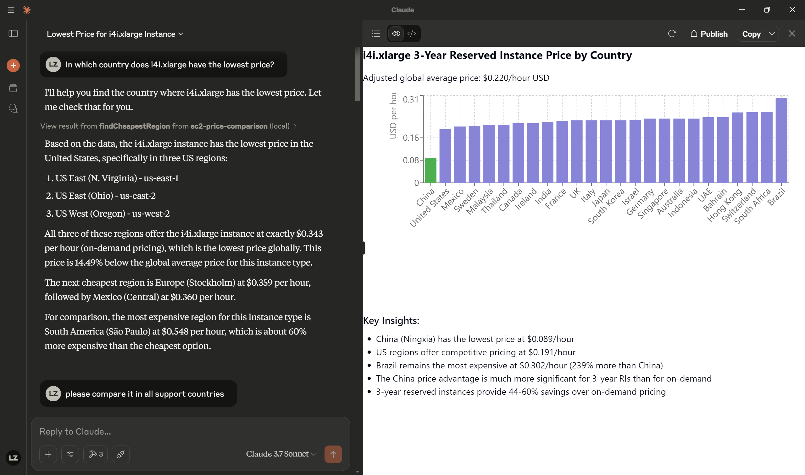
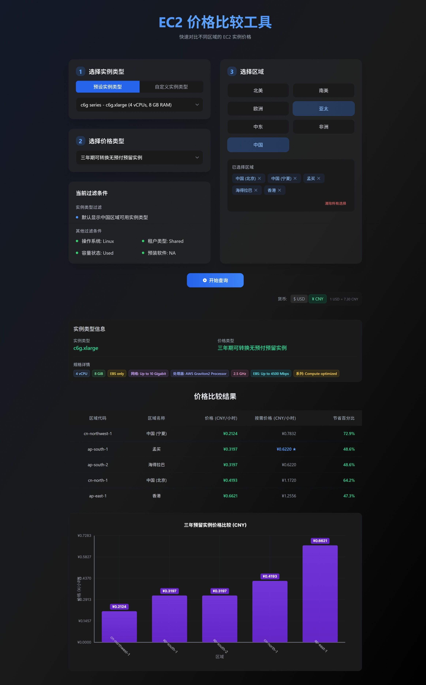

# EC2 Price Comparison Tool with MCP Integration

A full-stack application that compares EC2 instance pricing across multiple AWS regions, with support for both on-demand and reserved instances. Includes native Model Context Protocol (MCP) integration enabling AI assistants to access real-time EC2 pricing data.

> **⚠️ DISCLAIMER:** This tool is for development and educational purposes only. Not affiliated with or endorsed by Amazon Web Services. Pricing data may not be accurate for decision-making. See full disclaimer below.

> **Developed with modern AI tools:**
> - [Cursor](https://cursor.sh/) - AI-powered code editor
> - [Claude Code](https://claude.ai/code) - AI assistant for software development

## Author

**Sean Chang** (<sean@jinshuju.net>)





## Features

- **AI Integration via MCP**: Native Model Context Protocol support allowing AI assistants to query and analyze EC2 pricing data
- **Multi-Region Comparison**: Compare EC2 instance prices across ALL AWS regions including China regions
- **Data Visualization**: Interactive tables and charts with automatic data insights and cost-saving recommendations
- **Price Type Options**: Switch between On-Demand, 1-Year Reserved, and 3-Year Reserved pricing models
- **Customizable Instance Types**: Choose from preset options or enter any valid EC2 instance type
- **Detailed Instance Specifications**: View comprehensive instance attributes (vCPUs, Memory, Network Performance, etc.)
- **Currency Selection**: Toggle between USD and CNY with automatic currency conversion
- **Visual Comparison**: Interactive chart visualization with highlighted lowest-cost options
- **Real-time Data**: Direct integration with AWS Pricing API for current pricing information
- **Responsive Design**: Optimized for both desktop and mobile viewing

## Tech Stack

### Backend
- **Runtime**: Node.js with Express
- **Language**: TypeScript
- **AWS Integration**: AWS SDK v3 (Pricing API, EC2 API)
- **Error Handling**: Centralized middleware with HTTP status codes

### Frontend
- **Framework**: React 18 with TypeScript
- **Styling**: Tailwind CSS for responsive design
- **Build Tool**: Vite for fast development and optimized builds
- **State Management**: React Hooks (useState, useEffect)
- **Visualization**: Custom Canvas-based chart rendering
- **Form Handling**: Controlled components with validation

## Architecture

The application follows a client-server architecture:

### Backend Components
- **Controllers**: Handle HTTP requests and responses
- **Services**: Encapsulate business logic and AWS API interactions
- **Routes**: Define API endpoints and parameter validation
- **Middleware**: Manage logging, error handling, and request processing
- **Config**: Environment-specific configuration

### Frontend Components
- **App Component**: Main application container and state management
- **Services**: API interaction for fetching pricing data
- **Config**: Region definitions and application settings
- **UI Components**:
  - **InputSection**: Form controls for instance type selection, price type, region selection
  - **ResultsTable**: Tabular display of pricing data across regions
  - **PriceChart**: Interactive chart visualization for price comparison
  - **InstanceInfoCard**: Displays instance type specifications with badge UI
  - **ErrorDisplay**: Error message handling and display

## Getting Started

### Prerequisites

- Node.js 16.x or higher
- AWS account with programmatic access
- AWS credentials with the following permissions:
  - `pricing:GetProducts`
  - `ec2:DescribeInstanceTypes`
- Docker and Docker Compose (optional, for containerized setup)

### Using Docker (Recommended)

1. Clone the repository:
   ```bash
   git clone https://github.com/cnluzhang/ec2-price-comparison.git
   cd ec2-price-comparison
   ```

2. Configure AWS credentials:
   - Create a `.env` file in the backend directory based on `.env.example`
   - Add your AWS credentials to this file:
     ```
     AWS_REGION=us-east-1
     AWS_ACCESS_KEY_ID=your_access_key
     AWS_SECRET_ACCESS_KEY=your_secret_key
     
     # Optional: China region credentials if needed
     AWS_CN_ACCESS_KEY_ID=your_china_access_key
     AWS_CN_SECRET_ACCESS_KEY=your_china_secret_key
     ```

3. Start the application using Docker Compose:
   ```bash
   docker-compose up
   ```

4. Access the application at http://localhost:5173

5. For development, any changes to the code will automatically trigger hot-reloading.

6. To stop the application:
   ```bash
   docker-compose down
   ```

### Manual Setup

#### Backend Setup

1. Navigate to the backend directory:
   ```bash
   cd backend
   ```

2. Install dependencies:
   ```bash
   npm install
   ```

3. Configure AWS credentials:
   - Create a `.env` file in the backend directory
   - Add your AWS credentials:
     ```
     AWS_ACCESS_KEY_ID=your_access_key
     AWS_SECRET_ACCESS_KEY=your_secret_key
     AWS_REGION=us-east-1
     PORT=3001
     ```

4. Start development server:
   ```bash
   npm run dev
   ```
   
5. Build for production:
   ```bash
   npm run build
   ```

6. Run the MCP server (Model Context Protocol):
   ```bash
   # Development mode
   npm run mcp
   
   # Production mode
   npm run mcp:build
   ```

#### Frontend Setup

1. Navigate to the frontend directory:
   ```bash
   cd frontend
   ```

2. Install dependencies:
   ```bash
   npm install
   ```

3. Start development server:
   ```bash
   npm run dev
   ```

4. Build for production:
   ```bash
   npm run build
   npm run preview  # Preview the production build
   ```

5. Access the application at http://localhost:5173 (dev) or http://localhost:4173 (preview)

## Usage Guide

### Basic Usage

1. **Select AWS Regions**:
   - Click the region dropdown to select multiple AWS regions
   - Selected regions appear as tags that can be individually removed

2. **Choose Instance Type**:
   - Select a preset instance type from the dropdown
   - OR enter a custom instance type (e.g., `t3.micro`, `m5.xlarge`, `p5.48xlarge`)
   - Valid formats include standard instances (`t3.micro`), metal instances (`c5.metal`), 
     and specialized variants (`i8g.metal-24xl`)

3. **Select Price Type**:
   - Toggle between "On-Demand", "Reserved 1 Year", and "Reserved 3 Year" options
   - The chart will update to show the selected pricing model
   - Reserved instance pricing always includes comparison to on-demand prices

4. **Choose Currency**:
   - Toggle between USD and CNY display options

5. **View Results**:
   - Click "Search" to fetch and display the pricing data
   - The chart shows prices across selected regions
   - Lowest price cells are highlighted for quick identification
   - Instance specifications are displayed beneath the chart

### Advanced Tips

- **Multiple Region Comparison**: Select up to 10 regions to compare prices across different geographic areas
- **Instance Type Validation**: The app validates custom instance type formats in real-time
- **Price Analysis**: Compare the cost-effectiveness of reserved instances vs on-demand for long-term planning
- **Clear All**: Use the "Clear All" button to reset all selections and start a new comparison

## API Reference

### REST API Endpoints

#### GET /api/pricing

Returns pricing information for specified regions and instance types.

**Query Parameters**:
- `regions` (required): Comma-separated list of AWS region codes
- `instanceType` (required): EC2 instance type
- `priceType` (optional): Either "OnDemand" (default), "Reserved1Year", or "Reserved3Year"

**Response Format**:
```json
{
  "us-east-1": {
    "onDemandPrice": 0.0255,
    "reserved1YearPrice": 0.0177,
    "reserved3YearPrice": 0.0122,
    "instanceDetails": {
      "vCpus": 2,
      "memory": "8 GiB",
      "networkPerformance": "Up to 5 Gigabit"
    }
  },
  "eu-west-1": {
    "onDemandPrice": 0.0276,
    "reserved1YearPrice": 0.0191,
    "reserved3YearPrice": 0.0132,
    "instanceDetails": {
      "vCpus": 2,
      "memory": "8 GiB", 
      "networkPerformance": "Up to 5 Gigabit"
    }
  }
}
```

### MCP Integration

The application supports the Model Context Protocol (MCP), allowing LLMs to access EC2 pricing data directly.

#### MCP Resources

- `ec2://instance-types` - Lists available EC2 instance types
- `ec2://exchange-rate` - Returns the CNY to USD exchange rate
- `ec2://supported-regions` - Lists all supported AWS regions, explicitly including China regions

#### MCP Tools

- `getInstancePrices` - Fetches prices for EC2 instances
  - Parameters: `instanceType`, `regions` (optional), `priceType` (optional)

- `getInstanceSpecs` - Retrieves specifications for an EC2 instance type
  - Parameters: `instanceType`, `region` (optional)

- `findCheapestRegion` - Finds the cheapest AWS region with automatic USD conversion
  - Parameters: `instanceType`, `priceType` (optional)
  - Automatically converts all prices to USD for accurate comparison

#### MCP Prompts

- `compare-prices` - Compare EC2 instance prices across AWS regions including China regions
- `instance-specs` - Get detailed specifications for an EC2 instance type

For detailed documentation on using the MCP integration, see [backend/MCP.md](backend/MCP.md).

## Project Structure

```
/backend
  /src
    /config      # AWS and environment configuration
    /controllers # API endpoint handlers
    /middleware  # Express middleware
    /routes      # API route definitions
    /services    # Business logic and AWS API interaction
                 # Includes MCP service for AI integration
    /types       # TypeScript type definitions
    /utils       # Helper functions
    mcp-server.ts # MCP server entry point
  MCP.md        # MCP integration documentation

/frontend
  /src
    /assets      # Static assets
    /components  # Reusable UI components
    /config      # Application configuration
    /services    # API services
    App.tsx      # Main application component
```

## Development Guide

### Key Development Concepts

1. **AWS API Integration**:
   - The backend uses AWS SDK v3 to interact with the Pricing API
   - Region-specific pricing queries are executed in parallel for performance
   - Results are normalized to ensure consistent response structure

2. **React Component Architecture**:
   - The UI is divided into reusable components:
     - **InputSection**: Contains all input controls including:
       - Instance type selection (preset or custom)
       - Price type selection (OnDemand/Reserved)
       - Region selection with continent grouping
       - Filter display and currency selection
     - **ResultsTable**: Displays pricing data in tabular format with:
       - Region code and full name display
       - Price per hour with currency conversion
       - On-demand price comparison for reserved instances
       - Savings percentage calculation
     - **PriceChart**: Renders the visual chart comparison with:
       - Interactive bar chart for price comparison
       - Region labels on x-axis
       - Price labels on y-axis
       - Color-coding based on price type
     - **InstanceInfoCard**: Shows instance specifications with:
       - Badge-based UI for different specifications
       - Instance type and price type information
       - Fallback display when specs are unavailable
     - **ErrorDisplay**: Handles error messages with consistent styling

3. **Docker Development Environment**:
   - Docker Compose configures both frontend and backend services
   - Volume mounts enable hot reloading for development
   - Environment variables are managed through `.env` files

4. **Error Handling**:
   - Backend uses a centralized error middleware
   - Frontend displays user-friendly error messages for API failures
   - Validation prevents invalid inputs from being submitted

### Common Development Tasks

1. **Adding New AWS Regions**:
   - Update the `regions.ts` file in the frontend config directory
   - Add the region code, display name, and continent to the appropriate region group
   - The application now supports all current AWS regions including:
     - North America: US East/West, Canada Central/West, Mexico
     - Europe: Ireland, London, Paris, Frankfurt, Zurich, Stockholm, Milan, Spain
     - Asia Pacific: Tokyo, Seoul, Osaka, Singapore, Sydney, Jakarta, Melbourne, Malaysia, Thailand, Mumbai, Hyderabad, Hong Kong
     - Middle East: UAE, Bahrain, Israel
     - Africa: Cape Town
     - South America: São Paulo
     - China: Beijing, Ningxia

2. **Supporting New Instance Types**:
   - No code changes required; the application dynamically supports all valid EC2 instance types
   - Update validation regex if AWS introduces new instance type formats

3. **Extending the Chart**:
   - Modify the PriceChart component to add new visualizations or data points

## Troubleshooting

### Common Issues

1. **API Connection Errors**:
   - Verify your AWS credentials are correct in the backend `.env` file
   - Check that your AWS user has the required permissions

2. **Missing Price Data**:
   - Some instance types may not be available in all regions
   - New instance types may have delayed pricing information in the AWS API

3. **Chart Rendering Issues**:
   - If the chart appears blank, try selecting fewer regions or a different instance type
   - Ensure your browser supports the HTML5 Canvas API

4. **Docker Issues**:
   - If containers fail to start, check the logs with `docker-compose logs`
   - For permission issues with volumes, ensure proper file ownership

### Debugging Tips

- Check the browser console for frontend errors
- Review backend logs for API request failures
- Verify that backend and frontend servers are running on the expected ports

## Contributing

1. Fork the repository from [https://github.com/cnluzhang/ec2-price-comparison](https://github.com/cnluzhang/ec2-price-comparison)
2. Create a feature branch: `git checkout -b feature-name`
3. Commit your changes: `git commit -m 'Add feature'`
4. Push to the branch: `git push origin feature-name`
5. Submit a pull request to the main repository

### Development Standards

- Follow TypeScript strict mode guidelines
- Use consistent naming conventions (camelCase for variables, PascalCase for components)
- Add appropriate comments for complex logic
- Run linting before committing: `npm run lint`

## Disclaimer

This project, EC2 Price Comparison Tool, is:
- **Not affiliated with Amazon Web Services (AWS)**: This is an independent project not endorsed by, affiliated with, or sponsored by Amazon Web Services or its affiliates.
- **For development and educational purposes only**: The information and functionality provided by this application are intended solely for development, testing, and educational purposes.
- **Not guaranteed for accuracy**: While we strive for accuracy, we make no guarantees regarding the correctness, completeness, or reliability of pricing information or other data presented.
- **Not for production use**: This tool should not be used for production environments or for making financial or business decisions without independent verification.
- **Subject to AWS Terms of Service**: Usage of AWS APIs through this tool is subject to the AWS Terms of Service and other applicable AWS policies.
- **Provided "as is"**: This software is provided "as is", without warranty of any kind, express or implied.

Users are responsible for:
- Verifying any pricing information with official AWS sources before making decisions
- Ensuring their use of this tool complies with AWS Terms of Service
- Any costs incurred through AWS accounts used with this tool
- Proper handling of AWS credentials and compliance with security best practices

## License

This project is licensed under the MIT License - see the LICENSE file for details.

## Acknowledgements

- [AWS SDK for JavaScript](https://aws.amazon.com/sdk-for-javascript/)
- [React](https://reactjs.org/)
- [TypeScript](https://www.typescriptlang.org/)
- [Tailwind CSS](https://tailwindcss.com/)
- [Express](https://expressjs.com/)
- [Vite](https://vitejs.dev/)
- [Docker](https://www.docker.com/)
- [Cursor](https://cursor.sh/) - AI-powered code editor
- [Claude Code](https://claude.ai/code) - AI assistant for software development